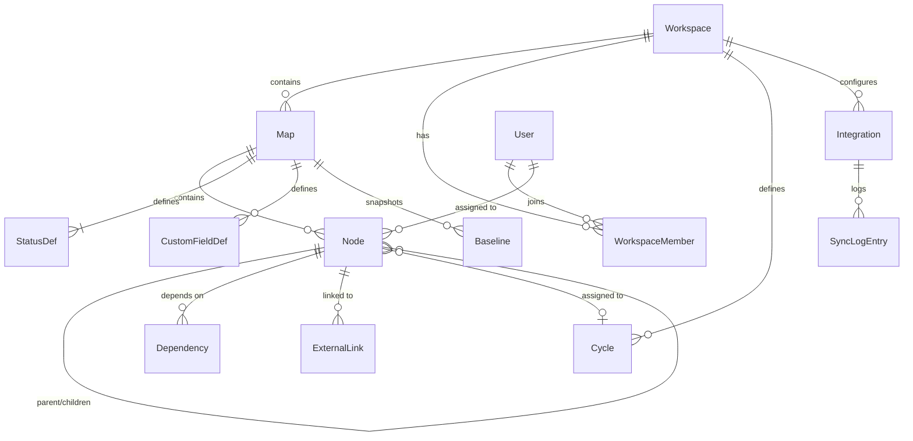
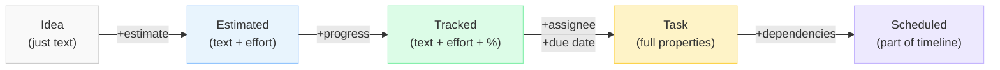
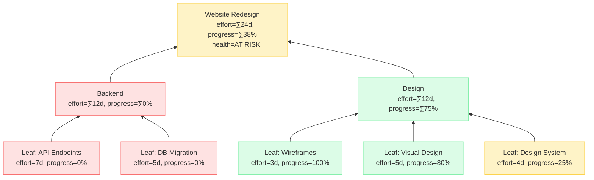
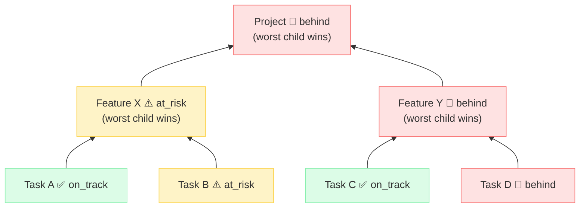
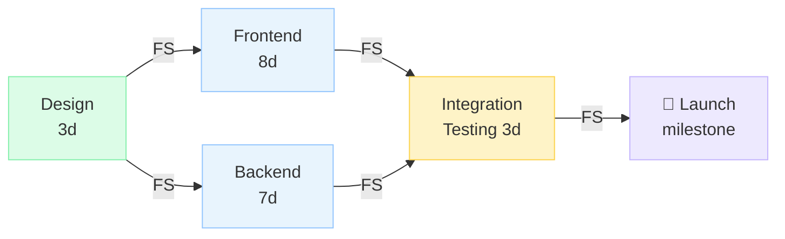
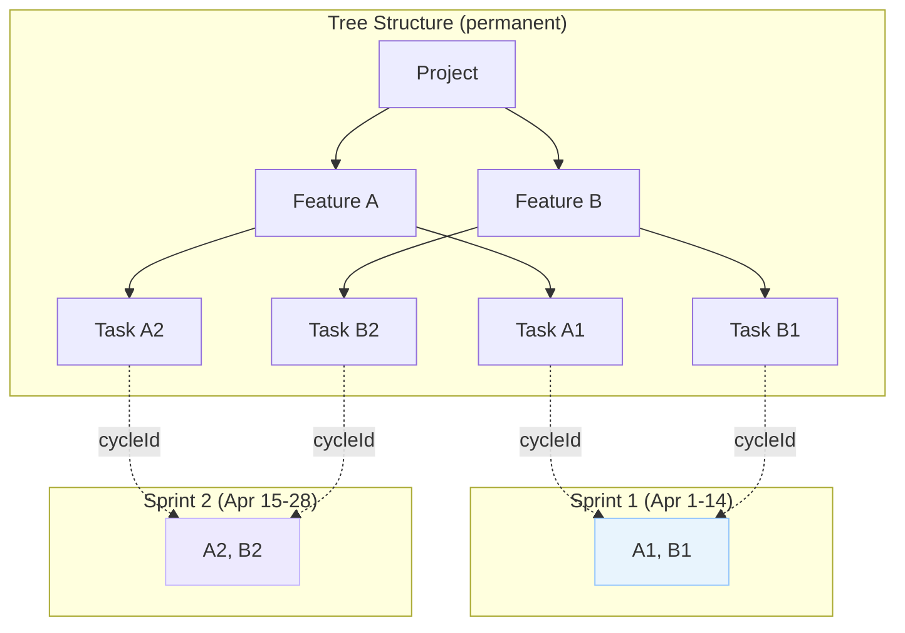
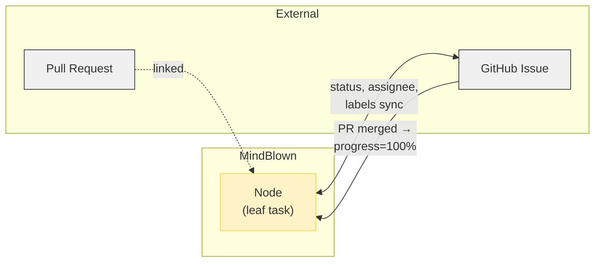
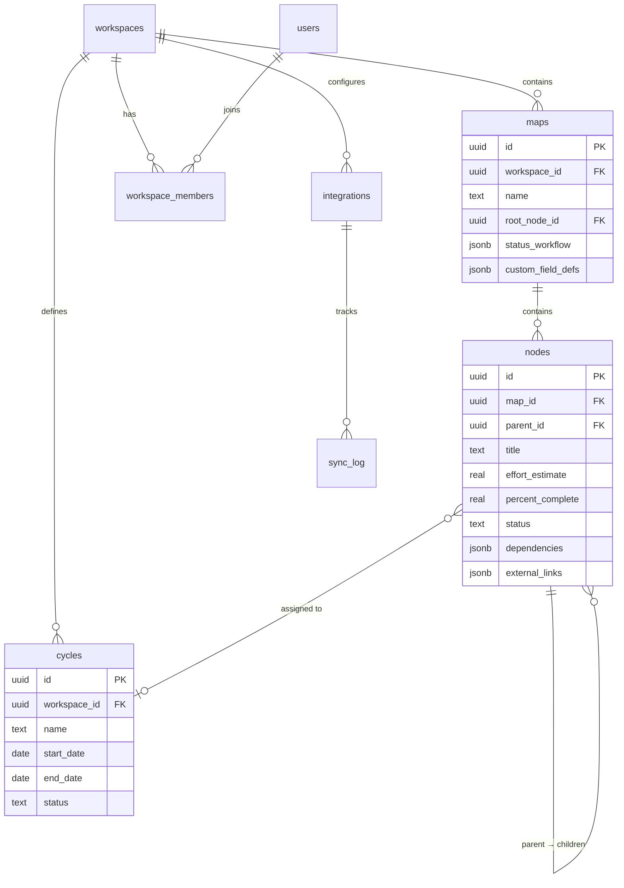

# Data Model

The core data model for MindBlown. Every agent building on this project should treat this document as the source of truth for how data is structured, computed, and persisted.

---

## Design Principles

1. **A node is everything.** There is no separate "task" type. A node starts as an idea and accumulates properties. The same schema powers the mindmap, kanban, gantt, list, and calendar views.
2. **Leaves hold truth, parents compute.** Effort estimates and % complete live on leaf nodes. Every ancestor auto-computes via weighted rollup.
3. **Gradual enrichment.** Most fields are optional. A node with only `id` and `text` is valid. Properties appear as the user adds them.
4. **Spatial and hierarchical simultaneously.** A node has both a position in 2D space (for the mindmap) and a position in a tree (parent/children). These are independent.

---

## Entity Relationship Overview



## Node as the Universal Object

Every view — mindmap, kanban, gantt, list, calendar — renders the same Node. The diagram below shows how a node accumulates properties through gradual enrichment:



---

## Node Schema

The node is the universal object. Every item in MindBlown is a node.

```typescript
/** Unique identifier. UUIDv7 for sortability + uniqueness. */
type NodeId = string;
type UserId = string;
type MapId = string;
type CycleId = string;
type MilestoneId = string;

/** The four standard dependency types. */
type DependencyType = 'FS' | 'SS' | 'FF' | 'SF';

/** Health signal, computed automatically. */
type HealthSignal = 'on_track' | 'at_risk' | 'behind';

/** Priority levels. */
type Priority = 'P0' | 'P1' | 'P2' | 'P3';

/** Effort unit, configured per map. */
type EffortUnit = 'hours' | 'days' | 'points';

/**
 * A custom field value. The shape depends on the field definition
 * on the Map (see MapSchema.customFieldDefs).
 */
type CustomFieldValue =
  | string
  | number
  | boolean
  | string[]   // multi-select
  | null;

/**
 * A dependency edge. Stored on the dependent (downstream) node.
 * "This node depends on `targetNodeId`."
 */
interface Dependency {
  targetNodeId: NodeId;
  type: DependencyType;
  /** Lag in the map's effort unit. Positive = delay, negative = overlap. */
  lag: number;
}

/**
 * An external link to an integration object (GitHub Issue, Jira ticket, etc.).
 */
interface ExternalLink {
  provider: string;        // 'github' | 'jira' | 'linear' | 'gitlab' | ...
  externalId: string;      // e.g. 'octocat/repo#42'
  url: string;             // direct link
  syncEnabled: boolean;    // whether bidirectional sync is active
  lastSyncedAt: string | null; // ISO 8601
}

/**
 * The core Node. Every field except id, mapId, and text is optional.
 * This is the canonical shape — the database stores this, the API
 * sends this, and every view reads from this.
 */
interface Node {
  // ── Identity ──────────────────────────────────────────────
  id: NodeId;
  mapId: MapId;

  // ── Tree structure ────────────────────────────────────────
  parentId: NodeId | null;          // null = root node
  childrenIds: NodeId[];            // ordered array — position = sort order

  // ── Content ───────────────────────────────────────────────
  text: string;                     // title / label shown on the node
  description: string | null;       // rich text (stored as HTML or ProseMirror JSON)

  // ── Spatial position (mindmap) ────────────────────────────
  x: number | null;                 // null = use auto-layout
  y: number | null;
  collapsed: boolean;               // whether children are hidden in mindmap view

  // ── Task properties (all optional — gradual enrichment) ───
  effortEstimate: number | null;    // leaf-only input; null = unestimated
  percentComplete: number | null;   // leaf-only input; 0–100; null = unset
  status: string | null;            // references a status from Map.statusWorkflow
  assigneeIds: UserId[];            // zero or more assignees
  priority: Priority | null;
  dueDate: string | null;           // ISO 8601 date
  startDate: string | null;         // ISO 8601 date
  tags: string[];                   // freeform labels
  customFields: Record<string, CustomFieldValue>;

  // ── Dependencies ──────────────────────────────────────────
  dependencies: Dependency[];       // "this node depends on ..."

  // ── Milestone ─────────────────────────────────────────────
  isMilestone: boolean;             // zero-effort checkpoint

  // ── Sprint / Cycle ────────────────────────────────────────
  cycleId: CycleId | null;

  // ── Integrations ──────────────────────────────────────────
  externalLinks: ExternalLink[];

  // ── Metadata ──────────────────────────────────────────────
  createdAt: string;                // ISO 8601
  updatedAt: string;                // ISO 8601
  createdBy: UserId;
}
```

### What is NOT stored on the node

These are computed at read time (see Computed Fields below):

- `computedEffort` — sum of descendant leaf estimates
- `computedProgress` — weighted average of descendant leaf progress
- `healthSignal` — derived from progress vs. elapsed time
- `criticalPath` — derived from dependency graph analysis
- `projectedEndDate` — derived from scheduling algorithm

We store inputs on nodes and compute outputs on demand. This avoids stale caches and keeps writes simple.

---

## Computed Fields

All computed values flow **upward** from leaves to root:



### Effort Rollup

A parent node's effort is the sum of its descendants' leaf estimates.

```
computedEffort(node):
  if node.childrenIds is empty:              // leaf
    return node.effortEstimate ?? 0
  return sum(computedEffort(child) for child in node.children)
```

Milestone nodes contribute zero effort regardless of children.

### Progress Rollup (Weighted)

A parent's progress is the effort-weighted average of its descendants' leaf progress.

```
computedProgress(node):
  if node.childrenIds is empty:              // leaf
    return node.percentComplete ?? 0

  totalEffort = 0
  weightedProgress = 0

  for child in node.children:
    childEffort = computedEffort(child)
    childProgress = computedProgress(child)
    totalEffort += childEffort
    weightedProgress += childEffort * childProgress

  if totalEffort == 0:
    return 0                                 // no estimates → 0%
  return weightedProgress / totalEffort
```

**Why weighted?** A 10-day task at 50% should contribute more to the parent's progress than a 1-day task at 50%. Unweighted averaging would treat them equally, giving a misleading picture.

**Unestimated leaves** (effortEstimate = null) are treated as 0 effort for rollup purposes. This means they don't affect the parent's progress calculation. The UI should surface a warning: "3 unestimated tasks — progress may be inaccurate."

### Health Signal

Health is computed per node and propagated upward.

```
healthSignal(node):
  if node.childrenIds is empty:              // leaf
    return leafHealth(node)
  
  childSignals = [healthSignal(child) for child in node.children]
  if any child is 'behind':
    return 'behind'
  if any child is 'at_risk':
    return 'at_risk'
  return 'on_track'
```

Leaf health depends on whether the node has dates:

```
leafHealth(node):
  if node.dueDate is null:
    return 'on_track'                        // no deadline = can't be late

  now = currentDate()
  progress = node.percentComplete ?? 0
  
  // Elapsed ratio: how much of the time window has passed
  if node.startDate is not null:
    totalDuration = dueDate - startDate
    elapsed = now - startDate
    elapsedRatio = clamp(elapsed / totalDuration, 0, 1)
  else:
    // No start date: use creation date as proxy
    totalDuration = dueDate - createdAt
    elapsed = now - createdAt
    elapsedRatio = clamp(elapsed / totalDuration, 0, 1)

  progressRatio = progress / 100

  if now > dueDate and progress < 100:
    return 'behind'                          // overdue
  if elapsedRatio - progressRatio > 0.2:
    return 'at_risk'                         // 20%+ behind pace
  return 'on_track'
```

The 0.2 threshold is configurable per map. The key idea: health compares "how much time has passed" vs "how much work is done."

**Propagation rule:** A parent is only as healthy as its sickest child. One `behind` leaf makes the entire ancestor chain `behind`. This ensures problems surface at the top without manual escalation.



---

## Tree Operations

All tree mutations must maintain referential integrity (parent/child links) and trigger recomputation of ancestors' computed fields.

### Insert Node

```
insertNode(parentId, index, nodeData):
  1. Create node with parentId set.
  2. Insert node.id into parent.childrenIds at index.
     (index = -1 or undefined → append at end)
  3. Recompute ancestors: effort, progress, health.
  4. If node has dependencies, validate no cycles in dependency graph.
```

### Move Node (Re-parent)

```
moveNode(nodeId, newParentId, index):
  1. Validate: newParentId is not a descendant of nodeId (no cycles).
  2. Remove nodeId from oldParent.childrenIds.
  3. Insert nodeId into newParent.childrenIds at index.
  4. Set node.parentId = newParentId.
  5. Recompute ancestors of BOTH old and new parents.
```

### Reorder Children

```
reorderChildren(parentId, newChildrenIds):
  1. Validate: newChildrenIds is a permutation of parent.childrenIds.
  2. Set parent.childrenIds = newChildrenIds.
  // No recomputation needed — order doesn't affect rollups.
```

### Delete Node

```
deleteNode(nodeId):
  1. Recursively collect all descendant node IDs.
  2. Remove all dependency edges pointing to/from these nodes.
  3. Remove nodeId from parent.childrenIds.
  4. Delete the node and all descendants.
  5. Recompute ancestors: effort, progress, health.
```

### Promote to Parent / Demote to Leaf

When a leaf node gets children added, it stops being a direct input for effort/progress and becomes a computed node. Its previous `effortEstimate` and `percentComplete` values are preserved but ignored in favor of children's rollup. If all children are removed, the node reverts to being a leaf and its stored values become active again.

---

## Dependency Model

Dependencies form a directed acyclic graph (DAG) separate from the tree hierarchy:



*In this example, the critical path is A → C → D → E (18 days). Frontend (B) has 4 days of float since it only takes 8 days vs Backend's 7 but Backend finishes later in the schedule due to the parallel path.*

### Storage

Dependencies are stored as an array on the dependent (downstream) node:

```
// Node A must finish before Node B starts (Finish-to-Start)
nodeB.dependencies = [{ targetNodeId: 'A', type: 'FS', lag: 0 }]
```

The four types:

| Type | Meaning | Constraint |
|------|---------|------------|
| FS | Finish-to-Start | B cannot start until A finishes (+lag) |
| SS | Start-to-Start | B cannot start until A starts (+lag) |
| FF | Finish-to-Finish | B cannot finish until A finishes (+lag) |
| SF | Start-to-Finish | B cannot finish until A starts (+lag) |

### Cycle Detection

Before adding a dependency, validate that it doesn't create a cycle. Use DFS from the target node following dependency edges. If we reach the source node, reject the dependency.

```
hasCycle(fromNodeId, toNodeId, allNodes):
  // Would adding fromNodeId → toNodeId create a cycle?
  // Check if toNodeId can reach fromNodeId via existing dependency edges.
  visited = Set()
  stack = [toNodeId]
  while stack is not empty:
    current = stack.pop()
    if current == fromNodeId:
      return true   // cycle detected
    if current in visited:
      continue
    visited.add(current)
    for dep in allNodes[current].dependencies:
      stack.push(dep.targetNodeId)
  return false
```

### Scheduling (Forward Pass)

Given nodes with effort estimates, start dates, and dependencies, compute the earliest possible start/end for each node.

```
schedule(nodes):
  // Topological sort by dependency edges
  sorted = topologicalSort(nodes)

  for node in sorted:
    earliestStart = node.startDate ?? projectStartDate

    for dep in node.dependencies:
      target = nodes[dep.targetNodeId]
      switch dep.type:
        case 'FS': constraint = target.computedEnd + dep.lag
        case 'SS': constraint = target.computedStart + dep.lag
        case 'FF': constraint = target.computedEnd + dep.lag - node.duration
        case 'SF': constraint = target.computedStart + dep.lag - node.duration
      earliestStart = max(earliestStart, constraint)

    node.computedStart = earliestStart
    node.computedEnd = earliestStart + node.duration
```

`duration` = `effortEstimate` for leaf nodes (in the map's effort unit). For nodes with assignees, duration can factor in parallelism (future enhancement).

### Critical Path

The critical path is the longest chain of dependent tasks from project start to end. It determines the minimum project duration.

```
criticalPath(nodes):
  1. Run forward pass (earliest start/end for all nodes).
  2. Run backward pass (latest start/end without delaying project).
  3. Nodes where earliestStart == latestStart have zero float → on the critical path.
  4. Return the chain of these zero-float nodes.
```

This is the standard CPM (Critical Path Method) algorithm. We compute it on demand when the user opens the Gantt view or requests schedule analysis.

---

## Map Schema

A Map is the container for a tree of nodes. It holds metadata and configuration.

```typescript
/** Custom field definition — lives on the map, values live on nodes. */
interface CustomFieldDef {
  id: string;
  name: string;
  type: 'text' | 'number' | 'date' | 'select' | 'multi_select' | 'person' | 'checkbox' | 'url';
  options?: string[];       // for select / multi_select
  required: boolean;
}

/** A status in the workflow. */
interface StatusDef {
  id: string;
  name: string;             // e.g. 'Todo', 'In Progress', 'Done'
  category: 'todo' | 'in_progress' | 'done'; // for view grouping and auto-progress
  color: string;            // hex
  position: number;         // sort order
}

/** A baseline snapshot for plan-vs-actual comparison. */
interface Baseline {
  id: string;
  name: string;             // e.g. 'Sprint 3 plan', 'Q2 kickoff'
  createdAt: string;
  /** Snapshot of every node's key planning fields at the time of baseline. */
  nodes: Record<NodeId, {
    effortEstimate: number | null;
    percentComplete: number | null;
    startDate: string | null;
    dueDate: string | null;
    status: string | null;
  }>;
}

/** Layout algorithm setting. */
type LayoutMode = 'radial' | 'tree_lr' | 'tree_td' | 'org_chart' | 'freeform';

/**
 * The Map — a project, a plan, a collection of nodes.
 */
interface Map {
  id: MapId;
  workspaceId: string;

  // ── Content ───────────────────────────────────────────────
  name: string;
  description: string | null;
  rootNodeId: NodeId;               // every map has exactly one root

  // ── Configuration ─────────────────────────────────────────
  effortUnit: EffortUnit;           // hours | days | points
  statusWorkflow: StatusDef[];      // ordered list of statuses
  customFieldDefs: CustomFieldDef[];
  defaultLayout: LayoutMode;
  healthThreshold: number;          // 0–1, default 0.2 (at_risk if 20% behind pace)

  // ── Baselines ─────────────────────────────────────────────
  baselines: Baseline[];

  // ── Metadata ──────────────────────────────────────────────
  createdAt: string;
  updatedAt: string;
  createdBy: UserId;
  archivedAt: string | null;
}
```

### Default Status Workflow

Every new map gets this workflow out of the box (opinionated defaults, per Linear's philosophy):

| Status | Category | Color |
|--------|----------|-------|
| Todo | todo | gray |
| In Progress | in_progress | blue |
| Done | done | green |

Users can add, rename, reorder, or remove statuses. The `category` field groups statuses for views (kanban columns default to categories) and drives auto-progress (a node with status in `done` category can auto-set to 100%).

---

## User / Team / Workspace Model

Minimal model for collaboration. We don't over-engineer auth — we need just enough to support multi-user editing and permissions.

```typescript
interface User {
  id: UserId;
  email: string;
  name: string;
  avatarUrl: string | null;
  createdAt: string;
}

interface Workspace {
  id: string;
  name: string;
  slug: string;              // URL-friendly identifier
  ownerId: UserId;
  createdAt: string;
}

interface WorkspaceMember {
  workspaceId: string;
  userId: UserId;
  role: 'owner' | 'admin' | 'member' | 'viewer';
  joinedAt: string;
}

/**
 * Per-map permissions. A user's effective permission is the
 * higher of their workspace role and their map-specific permission.
 */
interface MapPermission {
  mapId: MapId;
  userId: UserId;
  permission: 'view' | 'edit' | 'admin';
}
```

Workspace is the top-level container. Maps belong to workspaces. Users belong to workspaces via membership. For self-hosted single-user setups, there's one workspace with one user — the model still works.

---

## Sprint / Cycle Model

Cycles are an optional time-box overlay. They don't change the tree structure — they tag leaf nodes.



Cycles are an optional overlay on the tree. They don't change the tree structure — they tag leaf nodes with a time box.

```typescript
interface Cycle {
  id: CycleId;
  workspaceId: string;
  name: string;              // e.g. 'Sprint 14', 'April cycle'
  startDate: string;         // ISO 8601
  endDate: string;
  status: 'planned' | 'active' | 'completed';
  createdAt: string;
}
```

### How Cycles Work

- A leaf node's `cycleId` assigns it to a cycle.
- Parent nodes are NOT assigned to cycles — they span cycles implicitly.
- The cycle view filters nodes by `cycleId` across all maps in a workspace.
- Cycle progress = `computedProgress` over the set of nodes in the cycle (same weighted algorithm, but scoped to cycle members).
- Auto-rollover: when a cycle completes, unfinished nodes (percentComplete < 100 or status not in `done` category) are moved to the next cycle. The user confirms this action.

### Milestones

A milestone is just a node with `isMilestone: true`. Milestones:

- Have zero effort (ignored in rollup even if `effortEstimate` is set).
- Are "reached" when all children have status in the `done` category.
- Appear as diamonds on Gantt, markers on calendar, highlighted on map.
- Their date is auto-computed: the latest `computedEnd` among their children.

---

## Integration Model

MindBlown is the planning layer; external systems are the execution layer. Bridge keeps them in sync:



External links attach integration objects to nodes. The integration layer syncs data bidirectionally.

```typescript
/**
 * Integration configuration at the workspace level.
 * Stores credentials and sync settings.
 */
interface Integration {
  id: string;
  workspaceId: string;
  provider: string;           // 'github' | 'jira' | 'linear' | 'gitlab'
  config: Record<string, unknown>; // provider-specific (repo, project key, etc.)
  enabled: boolean;
  createdAt: string;
}

/**
 * Sync log entry — tracks what happened during each sync.
 */
interface SyncLogEntry {
  id: string;
  integrationId: string;
  nodeId: NodeId;
  direction: 'inbound' | 'outbound';
  fieldsSynced: string[];     // e.g. ['status', 'assigneeIds']
  timestamp: string;
  status: 'success' | 'conflict' | 'error';
  errorMessage: string | null;
}
```

### Sync Rules

The `ExternalLink` on a node (defined in the Node schema above) connects a node to an external object. When `syncEnabled` is true:

**Outbound (MindBlown -> External):**
- Status change -> update external issue status (via field mapping)
- Assignee change -> update external assignee
- Description change -> update external description
- `percentComplete` reaching 100 -> close external issue

**Inbound (External -> MindBlown):**
- External issue closed -> set `percentComplete = 100`, status to `done` category
- External assignee changed -> update `assigneeIds`
- External label changed -> update `tags`
- PR merged on linked issue -> optionally set progress to 100

**Conflict resolution:** Last-write-wins with a configurable grace period. If both sides change the same field within 60 seconds, the external system wins (since developers are likely working there). Conflicts are logged in `SyncLogEntry` for review.

### Field Mapping

Each integration defines a mapping between MindBlown fields and external fields:

```typescript
interface FieldMapping {
  integrationId: string;
  mindblownField: string;     // e.g. 'status', 'priority', 'assigneeIds'
  externalField: string;      // e.g. 'state', 'priority', 'assignees'
  valueMapping?: Record<string, string>; // e.g. { 'In Progress': 'open', 'Done': 'closed' }
}
```

---

## Database Representation



The TypeScript types above are the canonical shapes. For PostgreSQL persistence:

### `nodes` Table

| Column | Type | Notes |
|--------|------|-------|
| id | uuid (PK) | UUIDv7 |
| map_id | uuid (FK) | |
| parent_id | uuid (FK, nullable) | self-referencing |
| children_order | uuid[] | ordered array of child IDs |
| text | text | |
| description | jsonb | rich text as ProseMirror JSON |
| x | real | nullable |
| y | real | nullable |
| collapsed | boolean | default false |
| effort_estimate | real | nullable |
| percent_complete | real | nullable, 0–100 |
| status | text | nullable, references map workflow |
| assignee_ids | uuid[] | |
| priority | text | nullable |
| due_date | date | nullable |
| start_date | date | nullable |
| tags | text[] | |
| custom_fields | jsonb | |
| dependencies | jsonb | array of {targetNodeId, type, lag} |
| is_milestone | boolean | default false |
| cycle_id | uuid (FK, nullable) | |
| external_links | jsonb | array of ExternalLink |
| created_at | timestamptz | |
| updated_at | timestamptz | |
| created_by | uuid (FK) | |

**Indexes:**
- `(map_id)` — all nodes in a map (the primary query)
- `(parent_id)` — children of a node
- `(map_id, cycle_id)` — nodes in a cycle
- `(assignee_ids)` — GIN index for "my tasks" queries
- `(tags)` — GIN index for tag filtering

### Tree Query Pattern

To load an entire map's node tree:

```sql
SELECT * FROM nodes WHERE map_id = $1;
```

One query. The client builds the tree in memory from `parentId`/`childrenIds`. We do NOT use recursive CTEs for tree traversal — we load the full node set for a map and compute in the client. Maps are bounded in size (hundreds to low thousands of nodes), making this practical and fast.

For cross-map queries ("my tasks across all maps"):

```sql
SELECT * FROM nodes
WHERE $1 = ANY(assignee_ids)
  AND status NOT IN (SELECT id FROM ... WHERE category = 'done')
ORDER BY due_date NULLS LAST;
```

---

## Invariants

These must always hold:

1. Every map has exactly one root node (`parentId = null`).
2. `childrenIds` and `parentId` are consistent — if A lists B as child, B's parent is A.
3. The node tree is acyclic (no node is its own ancestor).
4. The dependency graph is acyclic (no circular dependencies).
5. `effortEstimate` and `percentComplete` are only user-editable on leaf nodes. On parent nodes, they are computed.
6. `childrenIds` contains no duplicates and no IDs of nodes from other maps.
7. `percentComplete` is in the range [0, 100] when set.
8. Deleting a node deletes all its descendants.
